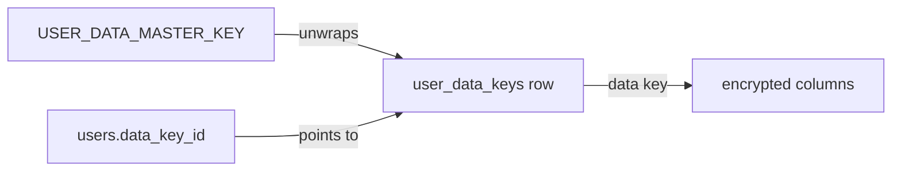

# Data Encryption

## What it is

Every user's free text is stored encrypted under a key that belongs to that user alone. The database, its dumps and the [admin panel](/features/admin-panel) never hold or show it in clear. Deleting an account destroys its key, which leaves that account's text unreadable everywhere the key is gone, backups included.

| Model       | Encrypted columns              |
| ----------- | ------------------------------ |
| `User`      | `name`                         |
| `Goal`      | `title`, `description`, `unit` |
| `GoalEntry` | `note`                         |
| `Milestone` | `title`, `description`         |
| `Category`  | `name`, `description`          |

Everything else stays in clear: email addresses (login and mail need them), numbers, dates, statuses, types, priorities, order, icons and colours. Charts, streaks, sorting and date filters therefore keep working in SQL.

## Limits

- **The server can decrypt.** The master key lives in the application's environment, so anyone holding the production secrets can read user text. Encryption protects against database dumps, backups, the admin panel and a database-only breach. It is not end-to-end or zero-knowledge encryption.
- **The shape of the data is visible.** How many goals a user has, when entries were logged and the values they hold are not encrypted.

## How it works

Two layers of keys:

- **Data key.** 32 random bytes per user, created with the account. It encrypts that user's text with AES-256-GCM through Laravel's `Encrypter`.
- **Master key.** `USER_DATA_MASTER_KEY`, one per installation. It only encrypts ("wraps") data keys and never touches user text. It is separate from `APP_KEY`, so rotating `APP_KEY` never affects user data.



The wrapped keys live in the `user_data_keys` table: a UUID, the wrapped key, and `master_key_id`, a short fingerprint of the master key that wrapped it. The table holds no user id. `users.data_key_id` points at the row.

A stored value looks like `v1:eyJpdiI6...`. The `v1:` prefix marks the value as encrypted and versions the format. Reading a value without the prefix from an encrypted column is an error, never a silent pass-through.

### In the models

The five models use the `App\Traits\Models\EncryptsUserData` trait. It declares the encrypted columns and how to find the row's owner: `user_id` for goals and categories, the goal's owner for entries and milestones, the user itself for `User`.

- **Writing.** The trait overrides `getAttributesForInsert()` and `getDirtyForUpdate()`, so only the values sent to SQL are encrypted, and only the changed ones. The model in memory, its observers and whatever it is returned to always see plaintext.
- **Reading.** A `retrieved` listener decrypts the loaded columns, so controllers, Inertia props and MCP responses need no changes.
- **Keys per request.** `UserDataKeyring` is a scoped container binding: each data key is unwrapped at most once per request or queued job, and nothing is cached beyond it.

A row is always encrypted with its owner's key, never the signed-in user's, so admin actions, console commands and the MCP local user write correctly.

### What SQL can no longer do on these columns

Ciphertext differs on every write, so `where`, `orderBy`, `LIKE` and database uniqueness rules cannot work on encrypted columns. Search on goal titles and descriptions and on entry notes (the web entries list and the MCP `list_goals` and `list_entries` tools) applies the other filters in SQL, then matches the text case-insensitively in PHP over that user's rows, then paginates.

Eloquent `pluck()` on an encrypted column throws rather than returning ciphertext. Load the models first and pluck from the collection.

## Account deletion

`User::booted()` hooks both ends of an account's life:

- **`creating`** generates the data key before the row is inserted, which is why the name can be encrypted in the same insert. This covers registration, social login, the admin panel, factories and seeders.
- **`deleting`** destroys the key before the user row goes. If the key store throws, the deletion is aborted. The account's rows then cascade away as before.

After deletion, anything still holding that user's text (an old database dump, a stray copy) is unreadable once no copy of the key remains. Where the key's copies live depends on `USER_DATA_KEYS_DB_URL`:

- **Unset (default).** Keys sit in the main database, so each main-database dump keeps the key of an account deleted after the dump was taken, for as long as you keep that dump.
- **Set.** Keys sit in a second PostgreSQL database. Give it short backup retention (for example 7 days): a deleted account's text is then unreadable everywhere once the last key-database backup holding its key expires, however long the main-database dumps are kept.

Losing the key database loses every user's text, exactly like losing the master key. Short retention means short, not none.

## Operating it

### Generating the master key

```bash
php artisan key:generate --show
```

Put the value in `USER_DATA_MASTER_KEY`, not `APP_KEY`, and keep a copy outside the server. The production container refuses to start without it.

### Encrypting existing data

The `encrypt_existing_user_data` migration runs `php artisan app:encrypt-existing-user-data`, so upgrading an installation that predates encryption only needs the master key set before `migrate`. The command gives every user without a key a new one and encrypts every value that is not already encrypted. It can be run again safely: a second run changes nothing. A value is treated as already encrypted only if it has the prefix and actually decrypts, so text a user happened to start with `v1:` is still encrypted.

Backups taken before that first migration hold plaintext.

### Rotating the master key

Rotation re-wraps the data keys and never re-encrypts user text, so no data can be lost as long as the previous key stays available until the end.

1. Generate a new key. Set it as `USER_DATA_MASTER_KEY` and move the old one to `USER_DATA_PREVIOUS_MASTER_KEYS`.
2. Run `php artisan app:rotate-user-data-master-key`. It re-wraps every data key still wrapped by a previous master key and prints how many keys each master key wraps. Running it again is safe.
3. When the output says no data key depends on a previous master key, empty `USER_DATA_PREVIOUS_MASTER_KEYS`.

`--check` prints the counts without changing anything.

Rotation protects against someone who holds only an old master key. It does not help if an old master key leaked together with a copy of the key table: the data keys it unwraps are unchanged and still decrypt current text. That case needs new data keys and re-encrypted text, which no command automates today.

### Adding an encrypted column

1. Make the column `text`: ciphertext is several times longer than the plaintext. Keep the length limit in validation.
2. Add it to the model's `encryptedAttributes()`.
3. Encrypt existing rows: add the table and column to `app:encrypt-existing-user-data` and ship a migration that runs the command again.
4. Make sure nothing queries it in SQL, and use `assertUserDataHas` in tests (see [Testing](/testing)).
